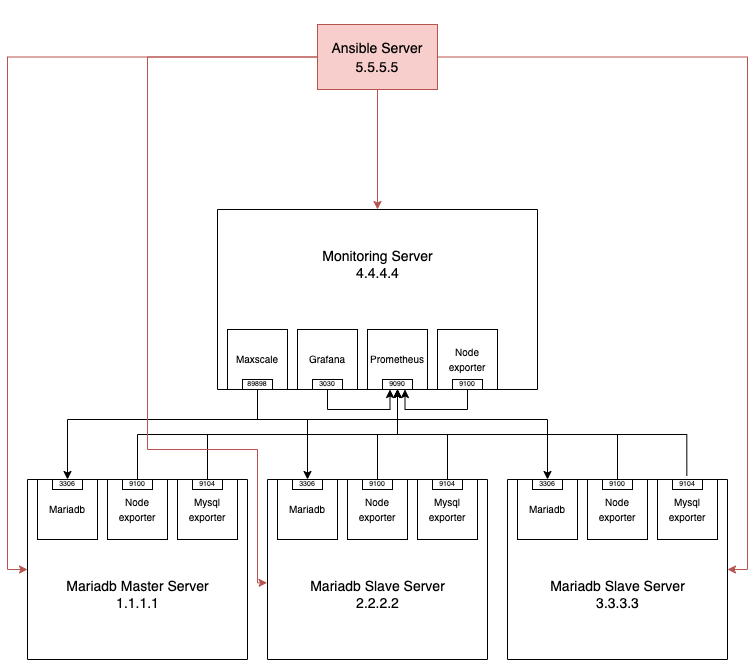

# Mariaddb cluster and monitoring



I follow these goals for this project:
# Goals:

- Working with git for project management 
- Basic monitoring concepts
- Automation using Ansible 
- Understanding MariaDB replication flow 
- Use different Prometheus exporters
- Work with docker and docker-compose


This project contains two main modules: the MariaDB cluster and monitoring.

# Mariadb Cluster
- MariaDB cluster with master/slave architecture (One master and two slaves)
- The database serves on port 3306.
- Use ubuntu 20.04 distribution.
- Run MySQL-exporter on each node on port 9104.
- Run node-exporter on each node on port 9100.
- Run max scale for monitoring the cluster.
- Enable auto-failover and auto rejoin max scale.
- Run each service with Docker containers.

# Monitoring:

- Prometheus for record metrics on port 9090.
- Grafana to visualiaze record from prometheus.
- Add MySQL-exporter and node-exporter dashboard to grafana.
- Set prometheus as grafana data source.


# Automation(ansible) 
- All automation must consider best practices and role base design
- Use Ansible Vault to encrypt confidential information

# Challenges
1. The network interfaces for my servers are controlled by DHCP. The dhclient program          overwrote the /etc/resolv. conf file whenever the networking service was restarted, so      when I changed the nameservers on /etc/resolv. conf wasn't fixed. I solve this issue by     installing the resolvconf package.
   To install this package and change nameservers on ubuntu 20.04, go through these steps  :
    1. Update your package index using apt:
     
        ```sh
         sudo apt update
         ```
    2. Install the resolvconf package using apt:
        ```sh
        sudo apt install  resolvconf
        ```
    3. Add the nameservers to /etc/resolvconf/resolv.conf.d/head .

    4. Run the update scripts for this package :
        ```sh
        sudo resolvconf -u
        ```
